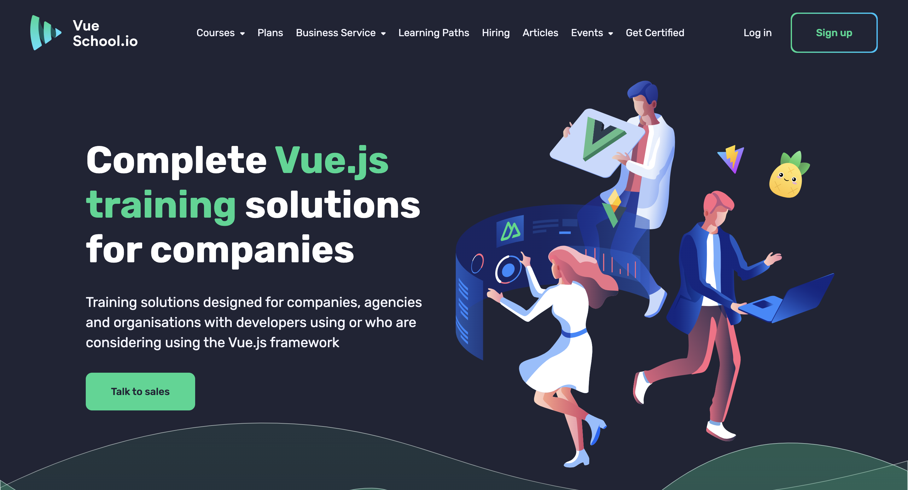
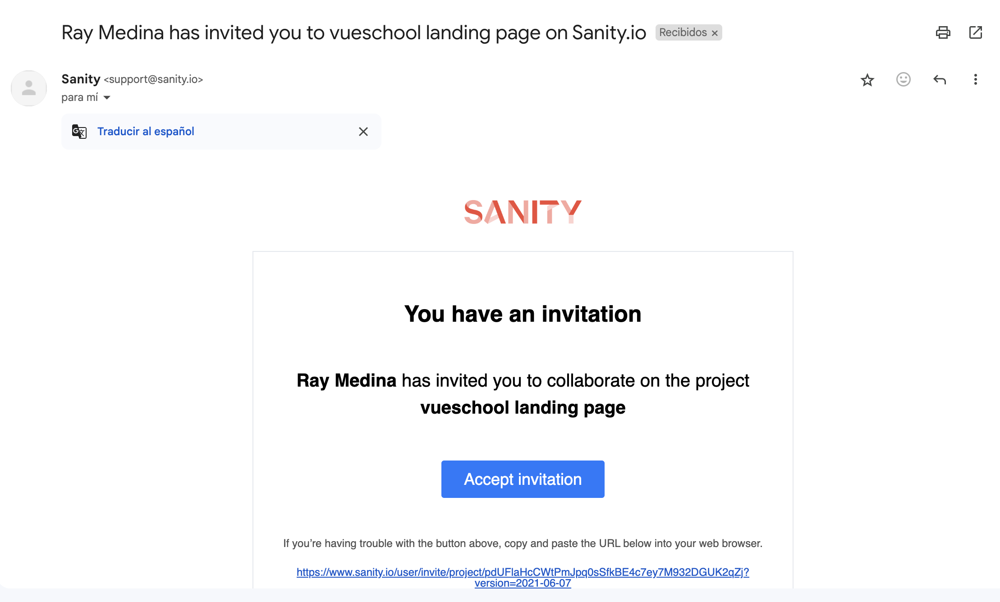
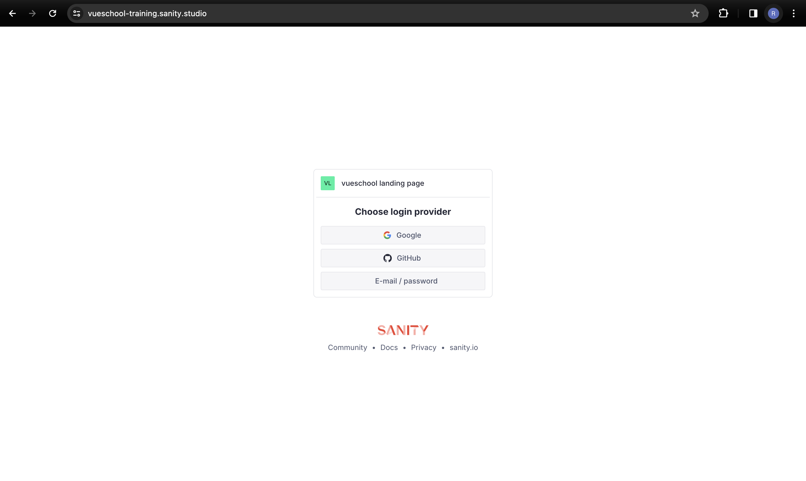
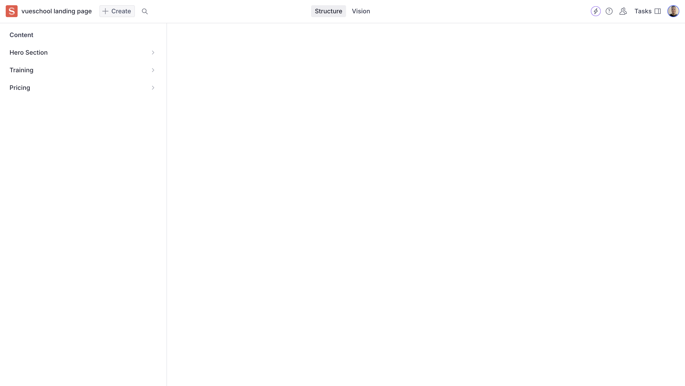
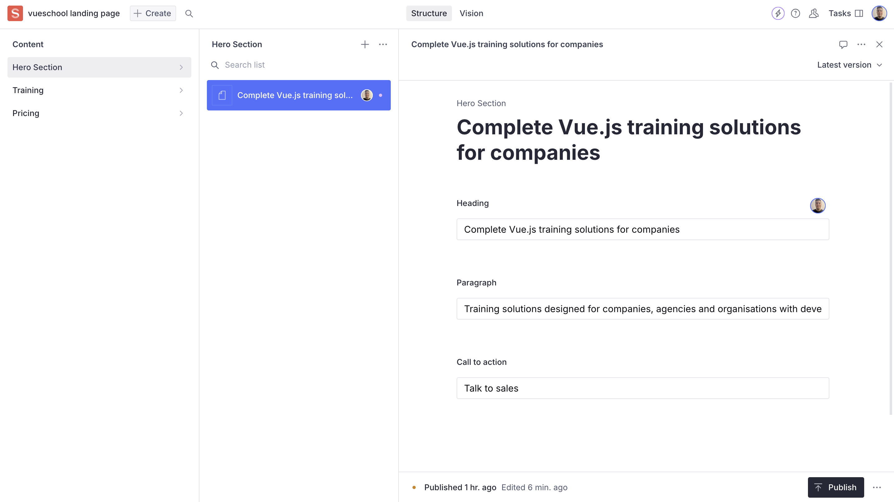
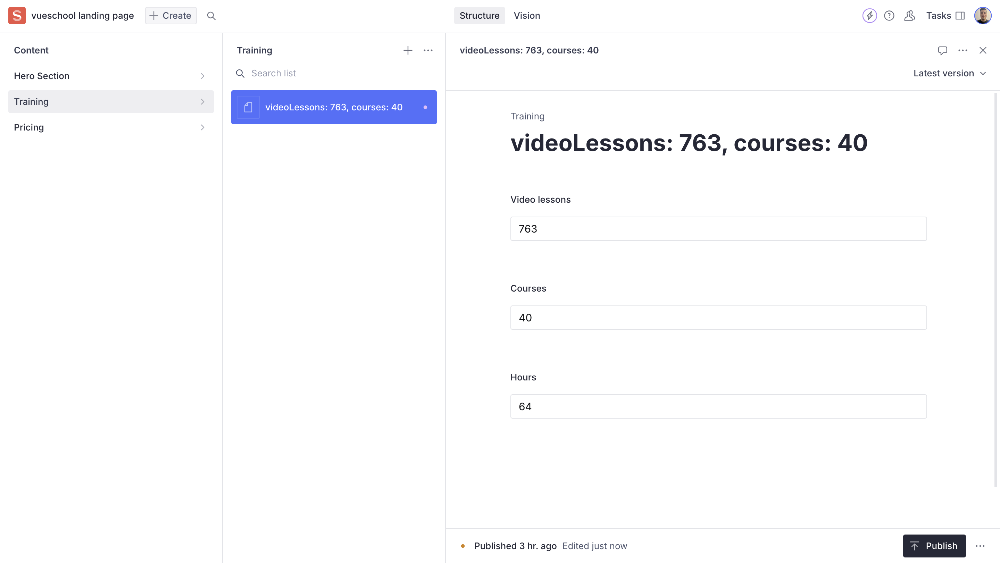
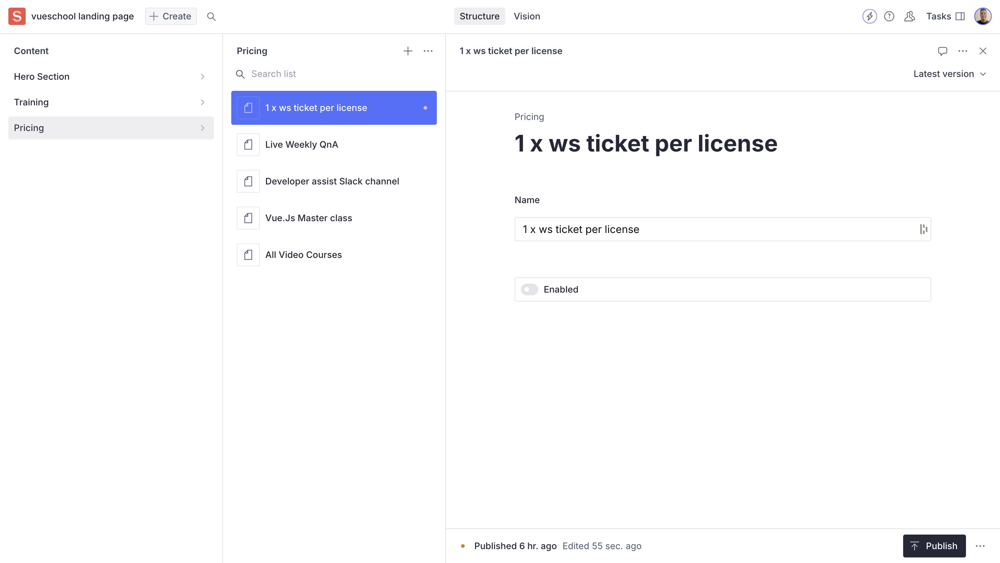

# Vue School corporate training landing page built in Nuxt 3

Look at the [Nuxt 3 documentation](https://nuxt.com/docs/getting-started/introduction) to learn more.



## Setup

Make sure to install the dependencies:

```bash
# npm
npm install

# pnpm
pnpm install

# yarn
yarn install

# bun
bun install
```

## Development Server

Start the development server on `http://localhost:3000`:

```bash
# npm
npm run dev

# pnpm
pnpm run dev

# yarn
yarn dev

# bun
bun run dev
```

## Production

Build the application for production:

```bash
# npm
npm run build

# pnpm
pnpm run build

# yarn
yarn build

# bun
bun run build
```

Locally preview production build:

```bash
# npm
npm run preview

# pnpm
pnpm run preview

# yarn
yarn preview

# bun
bun run preview
```

Check out the [deployment documentation](https://nuxt.com/docs/getting-started/deployment) for more information.

## Sanity CMS user guide

### Introduction

[Sanity](https://www.sanity.io/) is an open-source headless CMS that provides a user-friendly interface for managing, collaborating and customizing content that can be used by a website, applications or even an API.

### Prerequisites

- Request admin credentials to collaborate with the sanity project
- Accept the invitation sent to the email for collaborating with the project. You will receive an email like this:



### Step 1: Logging into Sanity CMS

- Open your web browser and navigate to the Sanity CMS login page for the [vue school landing page project](https://vueschool-training.sanity.studio/)
- Enter the credentials given through the email invite. You will see the following page:



### Step 2: Using Sanity studio

- After logging in, you will see the Sanity dashboard where you can open the studio for change the dynamic content of the [vue school landing page](https://vueschool-training.vercel.app/) in production
- Open Sanity studio an navigate through the content available in the current dataset. You will see the following page:



### Step 3: Updating dynamic content

- To update the Hero section (H1, paragraph, CTA), you must click on the Hero section content item and choose the document you want to edit or create a new one. You will see the following form:



- To update the lessons, courses and hours, you must click on the Training content item and choose the document you want to edit or create a new one. You will see the following form:



- To update all the pricing card bullet points, you must click on the Pricing content item, which in this case will display a list of all the bullet points items. You can add and edit as many items as you want. You will see the following form:



### Step 4: Publishing content to update the landing page

After making all desired changes to the content you must click on the Publish button in the lower right corner and refresh the landing page to see the latest updates.

### Conclusion

Congratulations! You have successfully updated the landing page using Sanity CMS. Now you can update all available dynamic content whenever you want without having to deal with website management.
